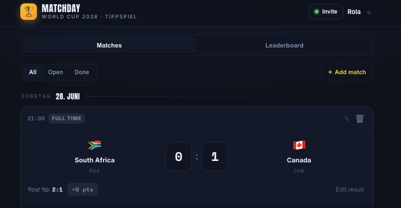

# ⚽ Matchday — World Cup 2026 Tippspiel

A lightweight, real-time football prediction game for a group of friends. No accounts, no sign-up: players open a link, type a name, and start predicting scores. Everyone shares one live leaderboard that updates as results come in.

🔗 **Live:** https://rhouhou.github.io/tippspiel/

 

---

## Features

- **Zero friction to join** — no registration or password; a name is all it takes.
- **Real-time shared leaderboard** — predictions and standings sync live across everyone's devices.
- **Score predictions with kick-off locking** — tips are editable until a match starts, then locked, after which everyone's picks are revealed.
- **Knockout-aware scoring** — on a draw prediction, players also pick who advances on penalties.
- **Host tools** — add, edit or remove fixtures and enter final results directly in the app.
- **Timezone-aware** — kick-off times are stored in UTC and shown in each viewer's local time.
- **Pre-loaded** with the 2026 World Cup Round of 32 fixtures.

## Scoring

| Outcome | Points |
| --- | --- |
| Exact scoreline | **3** |
| Correct winner (or advancing team on a draw) | **1** |
| Otherwise | 0 |

The "winner" is taken automatically from a non-draw prediction, or from the player's explicit penalty pick when they predict a draw — so calling the right team through counts even if the scoreline is off.

## Tech stack

- **Vanilla JavaScript, HTML & CSS** — no framework, no build step; the whole app is a single self-contained file.
- **Firebase Realtime Database** — shared state and live sync across clients.
- **Firebase Anonymous Auth** — silent, login-free identity so access can be gated by security rules.
- **GitHub Pages** — static hosting.

## Architecture in brief

State lives in a single Realtime Database tree (`rooms/{room}/{matches,players,preds}`). The client subscribes once with `onValue` and re-renders on every change, so all devices stay in sync without polling. Writes are made per-key (per prediction, per match) to keep concurrent updates from clobbering each other, and built-in fixtures are seeded with stable IDs so they can be topped up idempotently.

## Run it yourself

1. Create a Firebase project and a **Realtime Database**.
2. Enable **Anonymous** sign-in (Authentication → Sign-in method).
3. Paste your Firebase config into the `FIREBASE_CONFIG` block at the top of `index.html`.
4. Apply database rules that require auth (`".read": "auth != null"`, `".write": "auth != null"`), scoped to `rooms`.
5. Host `index.html` anywhere static (GitHub Pages, Netlify, etc.) and share the link.

## A note on the exposed Firebase config

The Firebase config in `index.html` is intentionally public — this is by design for Firebase web apps; the API key identifies the project but grants no access on its own. Access is controlled entirely by the database **security rules**, not by hiding the key. This is standard practice for client-side Firebase.

---

*A small personal project — built to run a World Cup pool with friends.*
